## **Курсовая работа на тему:**

### «Создание MVC-приложения интернет магазина электроники на Spring»

#### Иерархия страниц
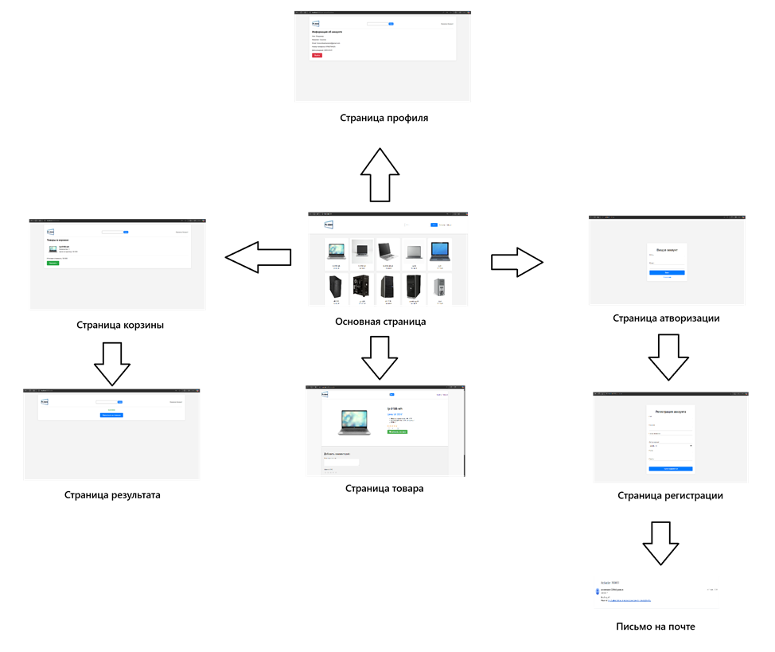

#### Главная страница
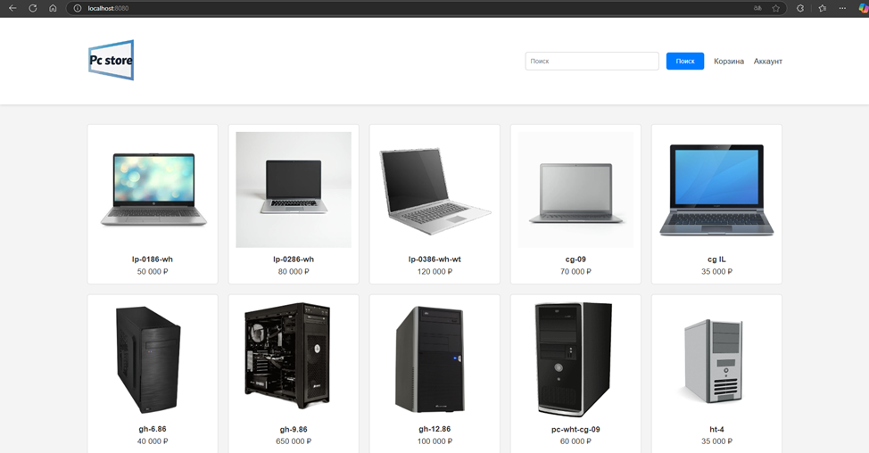

#### Страница товара
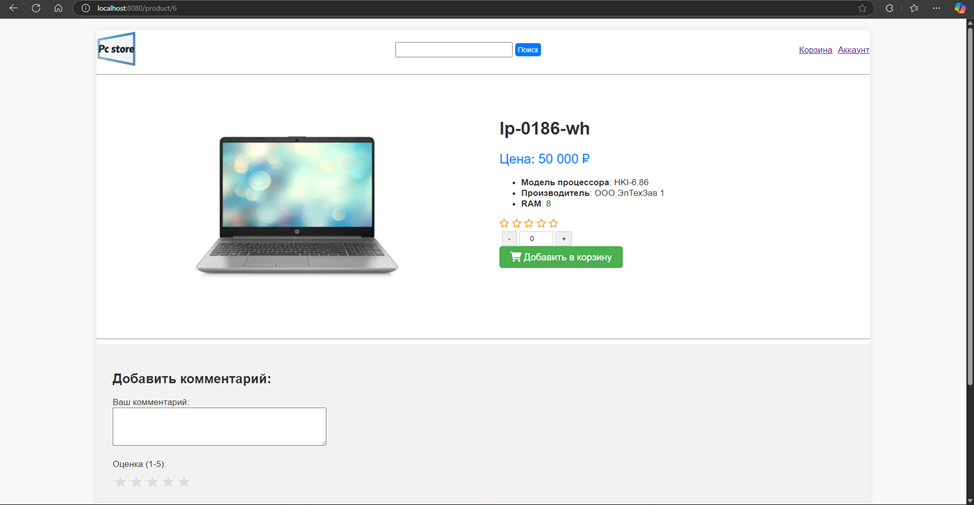

#### Страница авторизации
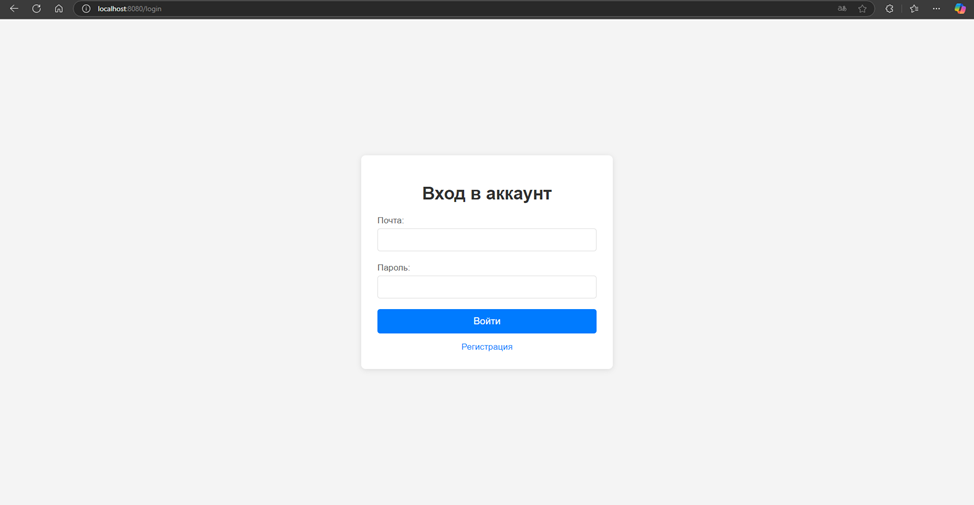

#### Страница регистрации
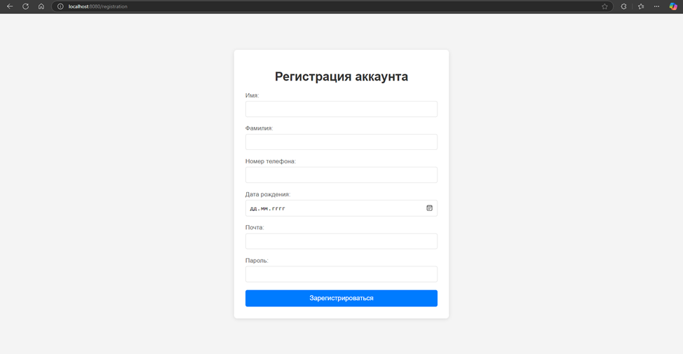

#### Активационное письмо, которое приходит пользователю на указанную почту
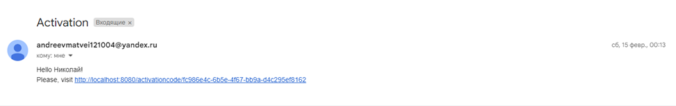

#### Страница профиля
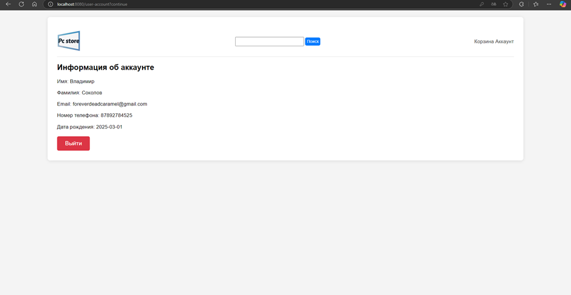

#### Страница корзины
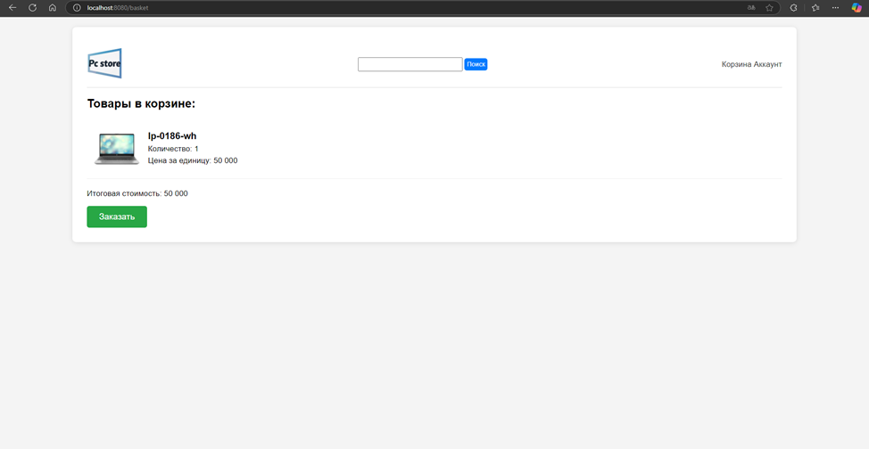

#### Страница результата
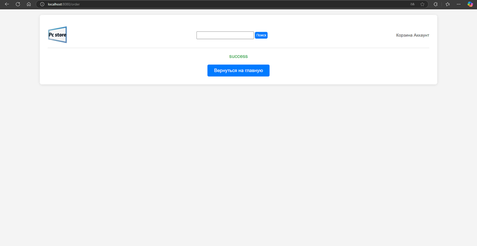

#### Отображение комментариев и вычисления оценки
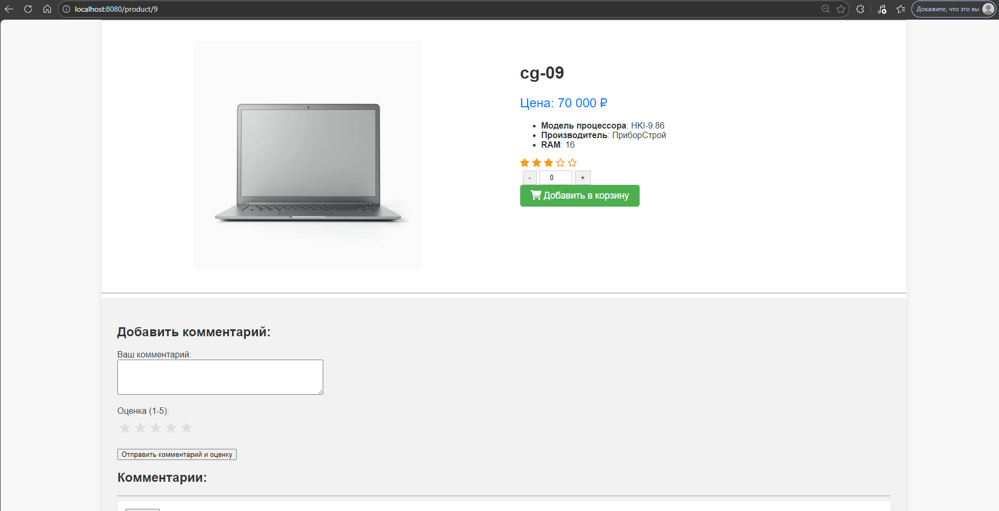
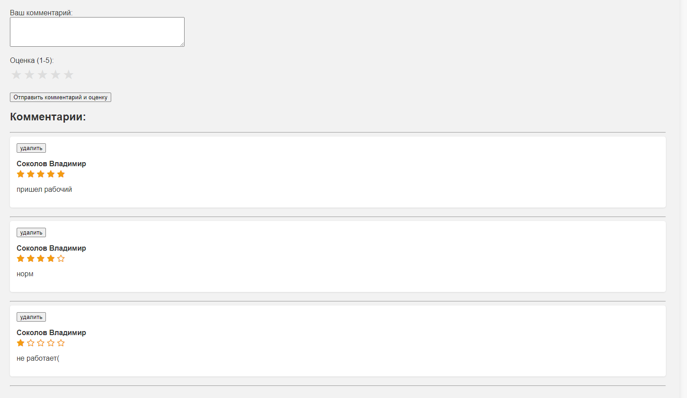

### Информация про DropBox API и Redis
#### Для хранения и загрузки пользовательских изображений используется DropBox API, в отличие от Yandex API для почты, для него используется сгенерированный временный токен, как временная мера для тестирования приложения 
#### Для хранения информации о пользовательской корзине был использован redis, запущенный в докере контейнере(образ был взят с dockerhub)